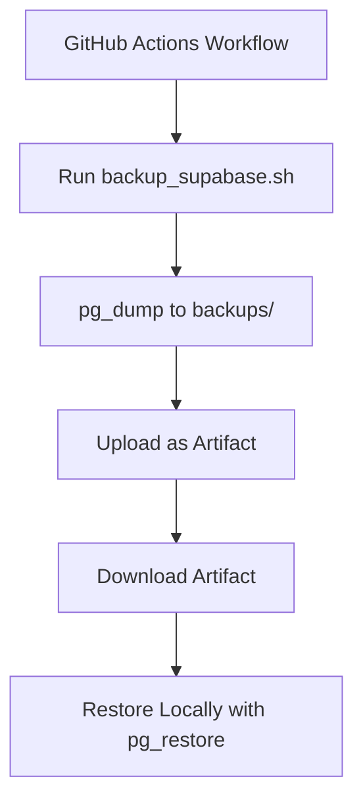

# Supabase Database Backup: CI/CD, Secrets, Script, and Restore Guide

## 1. Overview

This project uses a GitHub Actions workflow to automate daily backups of the Supabase database. The workflow securely connects to the remote Supabase instance, creates a backup using a custom script, and uploads the backup as a GitHub Actions artifact for download and disaster recovery.

---

## 2. Components

### a. GitHub Actions Workflow

- **Location:** `.github/workflows/supabase-backup.yml`
- **Triggers:**  
  - Scheduled: Runs daily at midnight UTC (`cron: '0 0 * * *'`)
  - Manual: Can be triggered via the GitHub Actions UI

- **Main Steps:**
  1. **Checkout the repository**
  2. **Install PostgreSQL client** (version 17)
  3. **Make the backup script executable**
  4. **Install Supabase CLI** (optional, for other steps)
  5. **Run the backup script** with secrets as environment variables
  6. **Upload the backup dump** as a GitHub Actions artifact (retained for 90 days)

- **Secrets Used:**  
  These are set in your GitHub repository settings under Settings → Secrets and variables → Actions.
  - `SUPABASE_PROJECT_REF`
  - `SUPABASE_POOLER_HOST`
  - `SUPABASE_POOLER_PORT`
  - `SUPABASE_DB_USER`
  - `SUPABASE_DB_PASSWORD`
  - (Optional) `SUPABASE_DB_NAME` (defaults to `postgres`)

---

### b. Backup Script

- **Location:** `backup_supabase.sh`
- **Purpose:** Connects to the remote Supabase database and creates a compressed backup using `pg_dump`.
- **Key Features:**
  - Loads environment variables from `.env` if present (for local/manual use)
  - Requires all necessary secrets to be set as environment variables
  - Dumps the database in custom format with a timestamped filename in the `backups/` directory
  - Retains only the 7 most recent backups (older ones are deleted automatically)

**Script Logic (simplified):**
```bash
# Load secrets from environment or .env
# Set backup directory and retention policy
# Run pg_dump with provided credentials and save to backups/supabase_backup_<timestamp>.dump
# Delete old backups, keeping only the most recent 7
```

---

## 3. How to Download the Backup Dump

1. **Go to your GitHub repository → Actions tab.**
2. **Find the latest successful run** of the "Supabase Backup" workflow.
3. **Click on the run**, scroll to the "Artifacts" section at the bottom.
4. **Download the artifact** (it will be a zip file containing one or more `.dump` files).
5. **Extract the `.dump` file** to your desired location, e.g., `ogettootachi-supabase-instance/backups/`.

---

## 4. How to Restore the Backup to Your Local Database

### a. Preparation

- Ensure your local Supabase instance is running:
  ```bash
  supabase start
  ```
- (Optional) Reset your local database to start fresh:
  ```bash
  supabase db reset
  ```

### b. Restore Command

From the directory containing the backup (e.g., `ogettootachi-supabase-instance`), run:

```bash
export PGPASSWORD=postgres
pg_restore \
  --host=localhost \
  --port=54322 \
  --username=postgres \
  --dbname=postgres \
  --no-owner \
  --clean \
  --verbose \
  backups/supabase_backup_<timestamp>.dump
```
- Replace `<timestamp>` with the actual timestamp in your downloaded file name.

**Notes:**
- The `--clean` flag drops existing objects before recreating them.
- The `--no-owner` flag avoids ownership issues.
- The `--verbose` flag provides detailed output.

---

## 5. Troubleshooting

- **File Not Found:**  
  Ensure you use the correct relative path to the `.dump` file from your current directory.
- **Permission Errors:**  
  Warnings about privileges or event triggers are normal when restoring to a local dev environment and can be ignored.
- **User Mismatch:**  
  If you want your local `auth.users` table to match remote, always restore from the latest backup after resetting the local DB.

---

## 6. Security

- **Secrets** are never stored in the repository. They are injected at runtime via GitHub Actions secrets.
- **Backups** are stored as GitHub Actions artifacts, accessible only to users with access to the repository.

---

## 7. Summary Diagram



---

## 8. References

- [Supabase CLI Docs](https://supabase.com/docs/guides/cli)
- [GitHub Actions Docs](https://docs.github.com/en/actions)
- [PostgreSQL pg_dump/pg_restore](https://www.postgresql.org/docs/current/app-pgdump.html)
